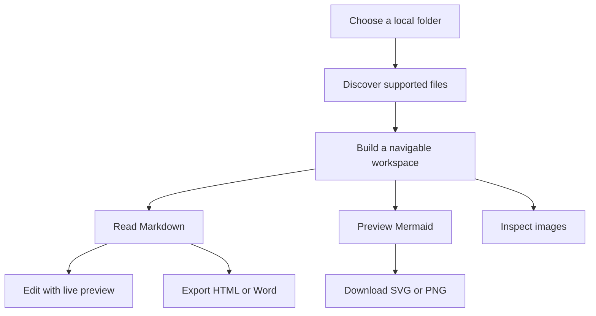

# From Folder to Focus

## Product flow

## Why it works

The current document remains the stable entry point while the Files panel provides quick access to related resources. Browser Back and Forward continue to behave naturally.

## Document capabilities

| Format | Read | Outline | Edit | Preview |
| --- | :---: | :---: | :---: | :---: |
| Markdown | ✓ | ✓ | ✓ | ✓ |
| Mermaid | ✓ | — | — | ✓ |
| SQL and text | ✓ | — | — | — |
| Images | ✓ | — | — | ✓ |

