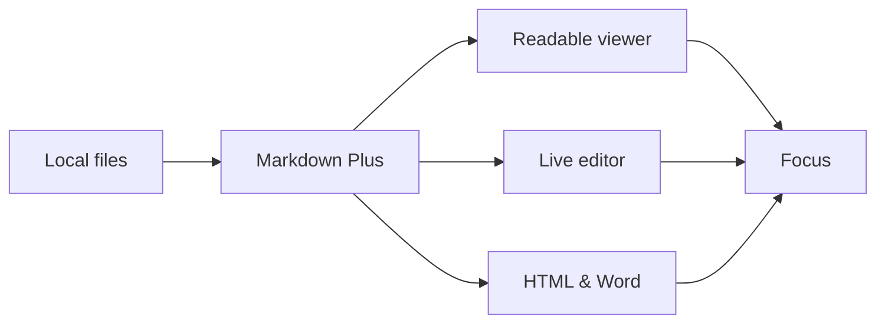

# Rich Markdown Showcase

Markdown Plus combines familiar Markdown with optional plugins that make technical documents easier to understand. :sparkles:

## Release readiness

- [x] Product brief approved
- [x] Diagram reviewed
- [x] Query validated
- [ ] Publish the next release

## Performance snapshot

| Metric | Current | Goal |
| --- | ---: | ---: |
| Viewer startup | 184 ms | < 250 ms |
| Workspace files | 148 | 200+ |
| Export success | 99.8% | 99.9% |

## A little mathematics

The reading-time estimate is based on words per minute:

$$
t = \frac{w}{200}
$$

Inline formulas such as $E = mc^2$ remain crisp in both light and dark themes.

## Highlighted code

```javascript
const workspace = await markdownPlus.openFolder()

for (const document of workspace.documents) {
  await document.render({ theme: 'aurora-glass' })
}
```

## Connected ideas



## Notes

The same document can mix tables, tasks, diagrams, math, emoji, and highlighted code without sending its contents to a hosted service.[^local]

[^local]: Remote resources referenced by the author may still be loaded by Chrome.

