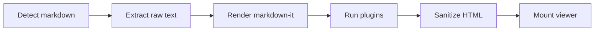
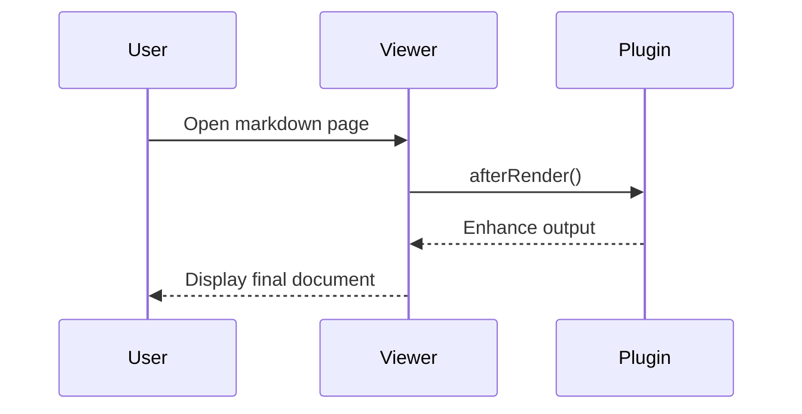

# Markdown Plus - Full Viewer Test Document

Tai lieu nay duoc viet de test toan bo Phase 6, Phase 7 va Phase 8.
Muc tieu: test TOC, plugin settings, code highlight, task list, anchor heading, table enhance, mermaid, math, footnote, emoji.
Ban co the bat tat plugin trong tab Plugins de quan sat thay doi.
Neu plugin hoat dong dung, cac khoi ben duoi se render ro rang.

---

## 1. TOC Sanity Check

### 1.1 Heading Level 3
Noi dung ngat dong de kiem tra khoang cach.

#### 1.1.1 Heading Level 4
Noi dung tiep theo.

##### 1.1.1.1 Heading Level 5
Noi dung tiep theo.

###### 1.1.1.1.1 Heading Level 6
Noi dung tiep theo.

### 1.2 Anchor Link Targets
Di chuyen TOC ben trai, click vao section bat ky de test scroll.
Khi bat plugin anchor heading, moi heading se co dau `#` o cuoi.

---

## 2. Basic Typography and Inline Elements

Doan van ban thuong de test line-height, font-size, font-family.
**Chu dam** de test strong.
*Chu nghieng* de test em.
***Dam va nghieng*** de test ket hop.
`inline code` de test mau code inline.
[External link to example](https://example.com) de test target blank.
[Another link to MDN](https://developer.mozilla.org) de test rel noopener.

> Blockquote line 1.
> Blockquote line 2.
> Blockquote line 3.

---

## 3. Ordered and Unordered Lists

- Item A
- Item B
- Item C
  - Item C.1
  - Item C.2
    - Item C.2.a
    - Item C.2.b
- Item D

1. Step one
2. Step two
3. Step three
4. Step four
5. Step five

---

## 4. Task List Plugin Scenarios

- [ ] Task 01: verify checkbox render
- [x] Task 02: verify checked state
- [ ] Task 03: verify spacing
- [x] Task 04: verify disabled checkbox
- [ ] Task 05: verify nested task list parent
  - [ ] Task 05.1 nested unchecked
  - [x] Task 05.2 nested checked
  - [ ] Task 05.3 nested unchecked
- [ ] Task 06: verify after toggle plugin OFF, marker text remains plain
- [x] Task 07: verify after toggle plugin ON, marker turns into checkbox
- [ ] Task 08: verify very long task title lorem ipsum dolor sit amet consectetur adipiscing elit sed do eiusmod tempor
- [x] Task 09: verify multiple checked items in sequence
- [x] Task 10: verify all done line

---

## 5. Code Highlight - JavaScript

```js
function fibonacci(n) {
  if (n <= 1) return n;
  let a = 0;
  let b = 1;
  for (let i = 2; i <= n; i += 1) {
    const next = a + b;
    a = b;
    b = next;
  }
  return b;
}

for (let i = 0; i < 10; i += 1) {
  console.log(i, fibonacci(i));
}
```

```js
const settingsPatch = {
  plugins: {
    codeHighlight: { enabled: true },
    taskList: { enabled: true }
  }
};

console.log("patch", settingsPatch);
```

---

## 6. Code Highlight - JSON and Bash

```json
{
  "name": "markdown-plus",
  "version": "0.1.0",
  "plugins": {
    "codeHighlight": { "enabled": true },
    "taskList": { "enabled": true },
    "anchorHeading": { "enabled": true },
    "tableEnhance": { "enabled": true }
  }
}
```

```bash
echo "Testing markdown viewer"
node -v
npm -v
npm run dev
```

---

## 7. Code Highlight - HTML and CSS

```html
<article class="doc">
  <h1>Hello Markdown Plus</h1>
  <p>Render me safely.</p>
</article>
```

```css
.doc {
  max-width: 980px;
  margin: 0 auto;
  line-height: 1.7;
}

.doc h1 {
  color: #0969da;
}
```

---

## 8. Tables for Table Enhance Plugin

Huong dan test nhanh:
1. Tat plugin `tableEnhance` -> table se render binh thuong, de bi tran ngang khi cot qua rong.
2. Bat plugin `tableEnhance` -> moi table duoc boc trong khung scroll ngang (`mdp-table-wrap`), UI ro rang hon.

| Name | Role | Status | Score |
| --- | --- | --- | ---: |
| Alpha | Reader | Active | 95 |
| Beta | Writer | Active | 87 |
| Gamma | Editor | Paused | 79 |
| Delta | Reviewer | Active | 91 |

| Col A | Col B | Col C | Col D | Col E |
| --- | --- | --- | --- | --- |
| A1 | B1 | C1 | D1 | E1 |
| A2 | B2 | C2 | D2 | E2 |
| A3 | B3 | C3 | D3 | E3 |
| A4 | B4 | C4 | D4 | E4 |
| A5 | B5 | C5 | D5 | E5 |

### 8.1 Wide Table Demo (de thay doi UI ro nhat)

| Col-01 | Col-02 | Col-03 | Col-04 | Col-05 | Col-06 | Col-07 | Col-08 |
| --- | --- | --- | --- | --- | --- | --- | --- |
| `very_long_token_without_spaces_aaaaaaaaaaaaaaaaaaaaaaaaaaaaaaaaaaaa` | `very_long_token_without_spaces_bbbbbbbbbbbbbbbbbbbbbbbbbbbbbbbbbbbb` | `very_long_token_without_spaces_cccccccccccccccccccccccccccccccccccc` | `very_long_token_without_spaces_dddddddddddddddddddddddddddddddddddd` | `very_long_token_without_spaces_eeeeeeeeeeeeeeeeeeeeeeeeeeeeeeeeeeee` | `very_long_token_without_spaces_ffffffffffffffffffffffffffffffffffff` | `very_long_token_without_spaces_gggggggggggggggggggggggggggggggggggg` | `very_long_token_without_spaces_hhhhhhhhhhhhhhhhhhhhhhhhhhhhhhhhhhhh` |
| 01 | 02 | 03 | 04 | 05 | 06 | 07 | 08 |

---

## 9. Long Table Stress Test

| ID | Description | Priority | Owner | ETA |
| ---: | --- | --- | --- | --- |
| 001 | Validate TOC click behavior | High | Team A | 1d |
| 002 | Validate scroll spy active heading | High | Team A | 1d |
| 003 | Validate settings drawer open close | Medium | Team B | 2d |
| 004 | Validate reader panel controls | Medium | Team B | 2d |
| 005 | Validate plugins tab toggles | High | Team C | 1d |
| 006 | Validate code block highlight | High | Team C | 1d |
| 007 | Validate task list plugin | High | Team C | 1d |
| 008 | Validate anchor heading plugin | High | Team C | 1d |
| 009 | Validate table enhance wrapper | Medium | Team C | 1d |
| 010 | Validate build output sanity | Low | Team D | 2d |
| 011 | Validate link target attributes | Medium | Team D | 1d |
| 012 | Validate sanitize pipeline | High | Team D | 2d |

---

## 10. Mixed Content Block A

Lorem ipsum dolor sit amet, consectetur adipiscing elit.
Sed do eiusmod tempor incididunt ut labore et dolore magna aliqua.
Ut enim ad minim veniam, quis nostrud exercitation ullamco laboris.
Nisi ut aliquip ex ea commodo consequat.
Duis aute irure dolor in reprehenderit in voluptate velit esse cillum dolore.
Eu fugiat nulla pariatur.
Excepteur sint occaecat cupidatat non proident.
Sunt in culpa qui officia deserunt mollit anim id est laborum.

### 10.1 Quick bullets
- one
- two
- three

---

## 11. Mixed Content Block B

Nam dui ligula, fringilla a, euismod sodales, sollicitudin vel, wisi.
Morbi auctor lorem non justo.
Nam lacus libero, pretium at, lobortis vitae, ultricies et, tellus.
Donec aliquet, tortor sed accumsan bibendum, erat ligula aliquet magna.
Vitae ornare odio metus a mi.
Morbi ac orci et nisl hendrerit mollis.
Suspendisse ut massa.
Curabitur vitae diam non enim vestibulum interdum.

### 11.1 Quote
> Testing quote format with punctuation.
> Testing second line.

---

## 12. Mixed Content Block C

Phasellus ultrices nulla quis nibh.
Quisque a lectus.
Donec consectetuer ligula vulputate sem tristique cursus.
Nam nulla quam, gravida non, commodo a, sodales sit amet, nisi.
Pellentesque fermentum dolor.
Aliquam quam lectus, facilisis auctor, ultrices ut, elementum vulputate, nunc.
Sed adipiscing ornare risus.
Morbi est est, blandit sit amet, sagittis vel, euismod vel, velit.

### 12.1 Inline marks
Use `code`, **bold**, *italic*, and [links](https://www.wikipedia.org).

---

## 13. Anchor Heading Visual Test

### 13.1 Section One
Neu plugin anchor heading bat, heading nay phai co dau `#`.

### 13.2 Section Two
Click vao dau `#` de thay doi URL hash.

### 13.3 Section Three
Sau do copy URL va mo tab moi de test.

### 13.4 Section Four
Kiem tra heading cap 3, 4, 5.

#### 13.4.1 Subsection
Noi dung con.

##### 13.4.1.1 Deep subsection
Noi dung con sau.

---

## 14. Plugin Toggle Checklist

1. Bat tat `codeHighlight` va so sanh code block.
2. Bat tat `taskList` va so sanh checkbox.
3. Bat tat `anchorHeading` va so sanh dau hash.
4. Bat tat `tableEnhance` va so sanh table horizontal scroll.
5. Doi theme light dark de xem mau.
6. Doi font size de xem text update.
7. Doi content width de xem layout update.
8. Tat TOC de xem sidebar bien mat.
9. Bat TOC lai va click heading.
10. Refresh page de test persisted settings.

---

## 15. Optional Plugins - Emoji and Footnote

Huong dan test nhanh:
1. Bat plugin `emoji` -> shortcode render thanh emoji.
2. Tat plugin `emoji` -> shortcode giu nguyen dang text.
3. Bat plugin `footnote` -> [^label] co superscript va khu vuc footnotes cuoi doan.
4. Tat plugin `footnote` -> cu phap footnote giu dang text.

Emoji demo:
- Basic: :smile: :rocket: :tada:
- Dev style: :bug: :wrench: :white_check_mark:
- Mix in sentence: Deploy complete :rocket: and tests passed :white_check_mark:

Footnote demo:
Doan nay co footnote thu nhat.[^phase8-a]
Doan nay co footnote thu hai voi link.[^phase8-b]
Doan nay co 2 footnotes lien tiep de test spacing.[^phase8-c][^phase8-d]

[^phase8-a]: Footnote 1 - noi dung co chu dam **bold** va `inline code`.
[^phase8-b]: Footnote 2 - xem them tai [MDN](https://developer.mozilla.org).
[^phase8-c]: Footnote 3 - test multiple refs.
[^phase8-d]: Footnote 4 - test backref.

---

## 16. Optional Plugins - Math (KaTeX)

Huong dan test nhanh:
1. Bat plugin `math` -> cong thuc render KaTeX.
2. Tat plugin `math` -> ky tu `$...$` va `$$...$$` giu nguyen.
3. Thu scroll ngang voi cong thuc dai.

Inline math:
- Pythagoras: $a^2 + b^2 = c^2$
- Euler identity: $e^{i\pi} + 1 = 0$
- Sigma: $\sum_{k=1}^{n} k = \frac{n(n+1)}{2}$

Display math:
$$
\int_{0}^{1} x^2 \, dx = \frac{1}{3}
$$

$$
\mathrm{softmax}(x_i) = \frac{e^{x_i}}{\sum_{j=1}^{n} e^{x_j}}
$$

$$
\nabla \cdot \vec{E} = \frac{\rho}{\varepsilon_0}
$$

```math
f(x) = \frac{1}{\sqrt{2\pi\sigma^2}} e^{- \frac{(x-\mu)^2}{2\sigma^2}}
```

---

## 17. Optional Plugins - Mermaid

Huong dan test nhanh:
1. Bat plugin `mermaid` -> khoi `mermaid` render thanh SVG diagram.
2. Tat plugin `mermaid` -> hien thi nhu code block thuong.
3. Thu diagram khong hop le de test graceful fallback.

Flowchart:


Sequence:


Invalid Mermaid (de test fallback):
```mermaid
this is not a valid mermaid diagram
```

---

## 18. Repeated Paragraph Set 01

Line 01: This line exists to increase document size.
Line 02: This line exists to increase document size.
Line 03: This line exists to increase document size.
Line 04: This line exists to increase document size.
Line 05: This line exists to increase document size.
Line 06: This line exists to increase document size.
Line 07: This line exists to increase document size.
Line 08: This line exists to increase document size.
Line 09: This line exists to increase document size.
Line 10: This line exists to increase document size.
Line 11: This line exists to increase document size.
Line 12: This line exists to increase document size.
Line 13: This line exists to increase document size.
Line 14: This line exists to increase document size.
Line 15: This line exists to increase document size.
Line 16: This line exists to increase document size.
Line 17: This line exists to increase document size.
Line 18: This line exists to increase document size.
Line 19: This line exists to increase document size.
Line 20: This line exists to increase document size.

---

## 19. Repeated Paragraph Set 02

Line 21: This line exists to increase document size.
Line 22: This line exists to increase document size.
Line 23: This line exists to increase document size.
Line 24: This line exists to increase document size.
Line 25: This line exists to increase document size.
Line 26: This line exists to increase document size.
Line 27: This line exists to increase document size.
Line 28: This line exists to increase document size.
Line 29: This line exists to increase document size.
Line 30: This line exists to increase document size.
Line 31: This line exists to increase document size.
Line 32: This line exists to increase document size.
Line 33: This line exists to increase document size.
Line 34: This line exists to increase document size.
Line 35: This line exists to increase document size.
Line 36: This line exists to increase document size.
Line 37: This line exists to increase document size.
Line 38: This line exists to increase document size.
Line 39: This line exists to increase document size.
Line 40: This line exists to increase document size.

---

## 20. Repeated Paragraph Set 03

Line 41: This line exists to increase document size.
Line 42: This line exists to increase document size.
Line 43: This line exists to increase document size.
Line 44: This line exists to increase document size.
Line 45: This line exists to increase document size.
Line 46: This line exists to increase document size.
Line 47: This line exists to increase document size.
Line 48: This line exists to increase document size.
Line 49: This line exists to increase document size.
Line 50: This line exists to increase document size.
Line 51: This line exists to increase document size.
Line 52: This line exists to increase document size.
Line 53: This line exists to increase document size.
Line 54: This line exists to increase document size.
Line 55: This line exists to increase document size.
Line 56: This line exists to increase document size.
Line 57: This line exists to increase document size.
Line 58: This line exists to increase document size.
Line 59: This line exists to increase document size.
Line 60: This line exists to increase document size.

---

## 21. Repeated Paragraph Set 04

Line 61: This line exists to increase document size.
Line 62: This line exists to increase document size.
Line 63: This line exists to increase document size.
Line 64: This line exists to increase document size.
Line 65: This line exists to increase document size.
Line 66: This line exists to increase document size.
Line 67: This line exists to increase document size.
Line 68: This line exists to increase document size.
Line 69: This line exists to increase document size.
Line 70: This line exists to increase document size.
Line 71: This line exists to increase document size.
Line 72: This line exists to increase document size.
Line 73: This line exists to increase document size.
Line 74: This line exists to increase document size.
Line 75: This line exists to increase document size.
Line 76: This line exists to increase document size.
Line 77: This line exists to increase document size.
Line 78: This line exists to increase document size.
Line 79: This line exists to increase document size.
Line 80: This line exists to increase document size.

---

## 22. Repeated Paragraph Set 05

Line 81: This line exists to increase document size.
Line 82: This line exists to increase document size.
Line 83: This line exists to increase document size.
Line 84: This line exists to increase document size.
Line 85: This line exists to increase document size.
Line 86: This line exists to increase document size.
Line 87: This line exists to increase document size.
Line 88: This line exists to increase document size.
Line 89: This line exists to increase document size.
Line 90: This line exists to increase document size.
Line 91: This line exists to increase document size.
Line 92: This line exists to increase document size.
Line 93: This line exists to increase document size.
Line 94: This line exists to increase document size.
Line 95: This line exists to increase document size.

Line 96: This line exists to increase document size.
Line 97: This line exists to increase document size.
Line 98: This line exists to increase document size.
Line 99: This line exists to increase document size.
Line 100: This line exists to increase document size.

---

## 23. Edge Cases - Markdown Syntax

### 23.1 Tight vs loose list
- tight item 1
- tight item 2
- tight item 3

- loose item 1

- loose item 2

- loose item 3

### 23.2 Reference links
Reference link style: [OpenAI Docs][openai-docs], [MDN][mdn], and missing ref [BrokenRef][not-found].

[openai-docs]: https://platform.openai.com/docs
[mdn]: https://developer.mozilla.org

### 23.3 Escaping and literals
- Escaped stars: \*not italic\*
- Escaped bracket: \[not a link]
- Escaped backtick: \`not code\`
- Mixed literal: \# heading text but not heading

### 23.4 Nested blockquote + list + code
> Quote level 1
> > Quote level 2
> > - item A
> > - item B
> > ```js
> > const inQuote = true
> > ```
> Back to level 1

### 23.5 Horizontal rule variants
---
***
___

---

## 24. Edge Cases - Raw HTML and Sanitization

<details>
  <summary>Native details/summary block</summary>
  <p>Should expand/collapse and keep typography readable.</p>
</details>

Inline HTML mark: <mark>highlight me</mark> and <kbd>Ctrl</kbd> + <kbd>S</kbd>.

---

## 25. Edge Cases - Plugin Interaction Matrix

### 25.1 Mermaid inside normal code fence (must stay plain code)
````txt

````

### 25.2 Math in code fence (must stay plain code)
```txt
Inline $a+b$ and display $$x^2$$ should not render in text/code fences.
```

### 25.3 Invalid math syntax (should fail gracefully)
Inline invalid: $ \frac{1}{ $

Display invalid:
$$
\frac{1}{\left(
$$

### 25.4 Footnote with multiline definition
Footnote with multiline body.[^multi-line-note]

[^multi-line-note]: First line in note.
    Second indented line in same note block.
    Third line with `inline code` and **bold**.

### 25.5 Emoji shortcode coverage
Expected render when emoji plugin ON:
:warning: :construction: :memo: :sparkles: :fire:

Expected plain text when emoji plugin OFF:
`:warning: :construction: :memo: :sparkles: :fire:`

---

## 26. Final Sanity Section

Neu ban doc den day, file da du dai de test.
Kiem tra:
- scroll performance tren file dai
- TOC rendering voi nhieu heading
- toc active item khi scroll nhanh
- plugin toggle va rerender
- table horizontal wrapper
- code highlight readability
- task checkbox transform
- heading anchor visibility
- emoji shortcode render
- footnote refs and backrefs
- math inline and display render
- mermaid diagram render and fallback
- reference links and escaped chars
- sanitize raw HTML/script/iframe
- plugin interactions in code fences
- invalid math graceful behavior

Ket thuc file test.
