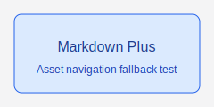
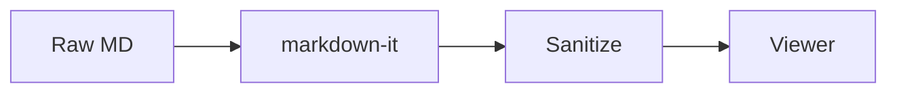
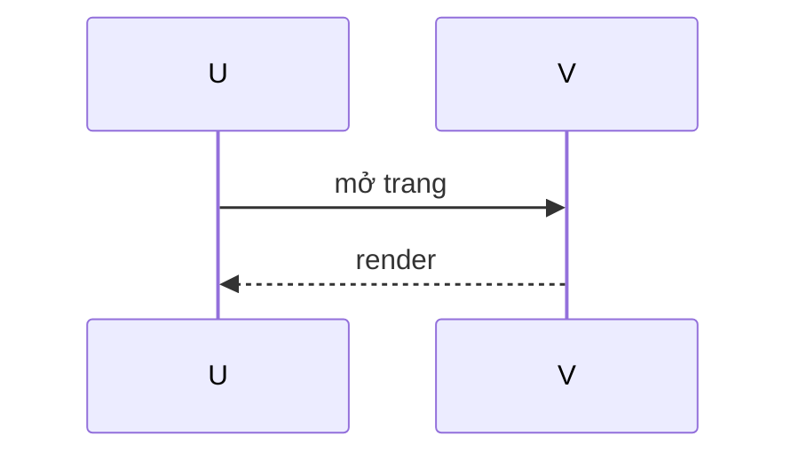
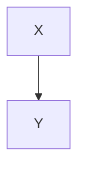

**Mẫu kiểm thử (không có heading)** — file này cố tình *không* dùng `#` … `######` cũng như setext `===` / `---` dưới dòng tiêu đề, để test viewer khi **TOC / Outline rỗng** hoặc “No headings found”, trong khi vẫn có đủ block và plugin phổ biến. Phía dưới là nhiều đoạn lặp để **cuộn dài**.

Mục tiêu tóm tắt: so khớp hành vi khi tài liệu chỉ có văn bản, list, bảng, code fence, mermaid, toán, footnote, task list, v.v. — **không** có cấu trúc heading.

**Bold** là nhấn mạnh; *italic* cho nhịp đọc; ***bold italic***; `inline code` cho token ngắn. Strikethrough: ~~bỏ qua bước cũ~~. Link ngoài: [Example](https://example.com), [MDN](https://developer.mozilla.org). Mailto: [gửi mail](mailto:test@example.com). Link nội bộ tương đối: [other.md](./other.md), [cài đặt](./guides/install.md). Tài sản: [diagram.svg](./assets/diagram.svg).

Reference-style: [OpenAI][openai-docs] và [trang bị hỏng][missing]. Ảnh nội bộ (kích thước tối đa theo theme):



[openai-docs]: https://platform.openai.com/docs
[missing]: https://this-domain-does-not-exist.invalid/path

---

Doạn văn thường (không phải heading) đủ dài: Lorem ipsum dolor sit amet, consectetur adipiscing elit. Integer feugiat, lorem at malesuada efficitur, arcu sapien vehicula risus, a suscipit nisl sapien non augue. Donec vitae tincidunt nisi. Pellentesque at mi vitae sapien efficitur fringilla. Phasellus a turpis a sem consequat tincidunt. Aenean sit amet magna a sem consequat tincidunt. Sed tincidunt, risus a convallis varius, magna sapien dictum sapien, a dictum sapien purus a sem.

> Trích dẫn một dòng.
>
> Trích dẫn nhiều dòng: đoạn này mô tả hành vi blockquote, margin và màu nền trong theme reader.
>
> > Lồng cấp hai: dùng để xem khoảng cách thụt và border trái.

- Danh sách gạch đầu dòng: mục A
- Mục B
  - Mục B.1 thụt
  - Mục B.2
- Mục C với *italic* bên trong

1. Số thứ tự bước một
2. Bước hai có `code`
3. Bước ba

**Task list (plugin bật/tắt):**

- [ ] Chưa làm
- [x] Đã xong
- [ ] Mục dài: lorem ipsum dolor sit amet consectetur adipiscing elit sed do eiusmod tempor incididunt ut labore
- [x] Nested
  - [ ] con 1
  - [x] con 2

Emoji (plugin): :smile: :rocket: :tada: :bug: :white_check_mark:

**Footnote (plugin):** Câu có chú thích đầu tiên.[^n1] Câu thứ hai với link.[^n2] Hai chú thích liên tiếp.[^n3][^n4]

[^n1]: Ghi chú với **bold** và `code`.
[^n2]: Xem [MDN](https://developer.mozilla.org).
[^n3]: Ghi chú 3 nhiều tham chiếu.
[^n4]: Ghi chú 4 trả vế.

**Toán (plugin):** Pythagoras $a^2 + b^2 = c^2$; tổng $\sum_{k=1}^{n} k = \frac{n(n+1)}{2}$. Khối display:

$$
\int_{0}^{1} x^2 \, dx = \frac{1}{3}
$$

Công thức mềm: $$\mathrm{softmax}(x_i) = \frac{e^{x_i}}{\sum_{j} e^{x_j}}$$

---

**Bảng (table enhance):**

| Tên   | Vai trò  | Trạng thái | Điểm |
| ----- | -------- | ---------- | ----: |
| Alpha | Đọc     | Active     | 95   |
| Beta  | Viết     | Active     | 87   |

Bảng rộng (stress ngang):

| C1  | C2  | C3  | C4  | C5  | C6  | C7  | C8  |
| --- | --- | --- | --- | --- | --- | --- | --- |
| `very_long_token_aaaaaaaa` | `very_long_token_bbbbbbbb` | `very_long_token_cccccccc` | `very_long_token_dddddddd` | `very_long_token_eeeeeeee` | `very_long_token_ffffffff` | `very_long_token_gggggggg` | `very_long_token_hhhhhhhh` |

---

**Code fence (highlight + copy):**

```js
export function sum(a, b) {
  return a + b;
}
export default sum;
```

```json
{
  "noHeadings": true,
  "scrollTest": "long"
}
```

```bash
set -euo pipefail
echo "ok"
node -e "console.log('node', process.version)"
```

```html
<article>
  <p>HTML trong fence — an toàn khi xem dạng code.</p>
</article>
```

```css
article {
  max-width: 70ch;
  line-height: 1.6;
}
```

Mermaid hợp lệ (plugin bật):





Mermaid không hợp lệ (kỳ vọng: fail nhẹ, không sập trang):

```mermaid
this is not valid mermaid syntax on purpose
```

Mermaid bị “đóng băng” trong fence khác mục (phải hiện dạng text):

````txt

````

Toán nằm trong fence thường (phải giữ nguyên ký tự, không render KaTeX):

```txt
Inline $a+b$ và display $$x^2$$ ở đây là chữ thô.
```

---

**HTML cho phép (sanitize):** Chi tiết có thể gấp lại bằng thẻ gốc.

<details>
  <summary>Mở rộng nội dung (details/summary)</summary>
  <p>Đoạn này nằm trong details; kiểm tra màu nền và <mark>mark</mark> cùng phím tắt <kbd>Ctrl</kbd> + <kbd>S</kbd>.</p>
</details>

**Raw HTML mẫu nằm trong code fence dưới đây** (không chạy script thật, chỉ test hiển thị/escape tùy pipeline):

```html
<script>alert('should not run')</script>
<iframe src="https://example.com"></iframe>
```

**Nested blockquote + list + code trong quote:**

> Cấp 1
> > Cấp 2 với list
> > - một
> > - hai
> > ```js
> > const q = "in quote"
> > ```
> Quay lại cấp 1

Cú pháp escape: \*not italic\*, \`not backtick\`, \# not a heading even if it looks like one at line start in prose.

**Horizontal rules** — các đường kẻ `---` trong file này đều có **dòng trống** ngay trước, để parser CommonMark tạo `<hr>` thay vì setext (tránh h2 giả từ `---` sát dòng chữ phía trên).

---

**Phần lặp để scroll** (vẫn *không* dùng ATX hay setext heading).

Đoạn lặp 01. Nulla facilisis, ligula eget tincidunt tincidunt, mi mi dictum sapien, a dictum sapien purus a sem. Sed vitae tincidunt sapien. Pellentesque at mi vitae sapien efficitur fringilla. Integer feugiat, lorem at malesuada efficitur, arcu sapien vehicula risus, a suscipit nisl sapien non augue. Donec vitae tincidunt nisi.

Đoạn lặp 02. Aenean sit amet magna a sem consequat tincidunt. Phasellus a turpis a sem consequat tincidunt. Sed tincidunt, risus a convallis varius, magna sapien dictum sapien, a dictum sapien purus a sem. Lorem ipsum dolor sit amet, consectetur adipiscing elit.

Đoạn lặp 03. Pellentesque at mi vitae sapien efficitur fringilla. Integer feugiat, lorem at malesuada efficitur, arcu sapien vehicula risus, a suscipit nisl sapien non augue. Donec vitae tincidunt nisi. Aenean sit amet magna a sem consequat tincidunt. Nulla facilisis, ligula eget tincidunt tincidunt, mi mi dictum sapien.

---

Đoạn lặp 04. Lorem ipsum dolor sit amet, consectetur adipiscing elit. Integer feugiat, lorem at malesuada efficitur, arcu sapien vehicula risus, a suscipit nisl sapien non augue. Donec vitae tincidunt nisi. Pellentesque at mi vitae sapien efficitur fringilla. Phasellus a turpis a sem consequat tincidunt.

Đoạn lặp 05. Sed tincidunt, risus a convallis varius, magna sapien dictum sapien, a dictum sapien purus a sem. Aenean sit amet magna a sem consequat tincidunt. Pellentesque at mi vitae sapien efficitur fringilla. Lorem ipsum dolor sit amet, consectetur adipiscing elit.

---

Đoạn lặp 06. Nulla facilisis, ligula eget tincidunt tincidunt, mi mi dictum sapien, a dictum sapien purus a sem. Integer feugiat, lorem at malesuada efficitur, arcu sapien vehicula risus, a suscipit nisl sapien non augue. Phasellus a turpis a sem consequat tincidunt. Sed tincidunt, risus a convallis varius, magna sapien dictum sapien.

---

Đoạn lặp 07. Donec vitae tincidunt nisi. Aenean sit amet magna a sem consequat tincidunt. Pellentesque at mi vitae sapien efficitur fringilla. Lorem ipsum dolor sit amet, consectetur adipiscing elit. Integer feugiat, lorem at malesuada efficitur, arcu sapien vehicula risus.

---

Đoạn lặp 08. A suscipit nisl sapien non augue. Phasellus a turpis a sem consequat tincidunt. Nulla facilisis, ligula eget tincidunt tincidunt, mi mi dictum sapien, a dictum sapien purus a sem. Nulla facilisis, ligula eget tincidunt tincidunt, mi mi dictum sapien. Sed tincidunt, risus a convallis varius, magna sapien dictum sapien.

---

Đoạn lặp 09. Pellentesque at mi vitae sapien efficitur fringilla. Integer feugiat, lorem at malesuada efficitur, arcu sapien vehicula risus, a suscipit nisl sapien non augue. Donec vitae tincidunt nisi. Aenean sit amet magna a sem consequat tincidunt. Lorem ipsum dolor sit amet, consectetur adipiscing elit.

---

Đoạn lặp 10. Phasellus a turpis a sem consequat tincidunt. Nulla facilisis, ligula eget tincidunt tincidunt, mi mi dictum sapien, a dictum sapien purus a sem. Sed tincidunt, risus a convallis varius, magna sapien dictum sapien, a dictum sapien purus a sem. Pellentesque at mi vitae sapien efficitur fringilla. Integer feugiat, lorem at malesuada efficitur, arcu sapien vehicula risus.

---

Đoạn lặp 11. Arcu sapien vehicula risus, a suscipit nisl sapien non augue. Donec vitae tincidunt nisi. Aenean sit amet magna a sem consequat tincidunt. Phasellus a turpis a sem consequat tincidunt. Lorem ipsum dolor sit amet, consectetur adipiscing elit.

---

Đoạn lặp 12. Pellentesque at mi vitae sapien efficitur fringilla. Integer feugiat, lorem at malesuada efficitur, arcu sapien vehicula risus, a suscipit nisl sapien non augue. Nulla facilisis, ligula eget tincidunt tincidunt, mi mi dictum sapien, a dictum sapien purus a sem. Sed tincidunt, risus a convallis varius, magna sapien dictum sapien, a dictum sapien purus a sem. Donec vitae tincidunt nisi.

---

Đoạn lặp 13. Aenean sit amet magna a sem consequat tincidunt. Lorem ipsum dolor sit amet, consectetur adipiscing elit. Phasellus a turpis a sem consequat tincidunt. Pellentesque at mi vitae sapien efficitur fringilla. Integer feugiat, lorem at malesuada efficitur, arcu sapien vehicula risus.

---

Đoạn lặp 14. A suscipit nisl sapien non augue. Nulla facilisis, ligula eget tincidunt tincidunt, mi mi dictum sapien, a dictum sapien purus a sem. Donec vitae tincidunt nisi. Aenean sit amet magna a sem consequat tincidunt. Sed tincidunt, risus a convallis varius, magna sapien dictum sapien, a dictum sapien purus a sem.

---

Đoạn lặp 15. Phasellus a turpis a sem consequat tincidunt. Pellentesque at mi vitae sapien efficitur fringilla. Lorem ipsum dolor sit amet, consectetur adipiscing elit. Integer feugiat, lorem at malesuada efficitur, arcu sapien vehicula risus, a suscipit nisl sapien non augue. Aenean sit amet magna a sem consequat tincidunt.

---

Đoạn lặp 16. Nulla facilisis, ligula eget tincidunt tincidunt, mi mi dictum sapien, a dictum sapien purus a sem. Donec vitae tincidunt nisi. Sed tincidunt, risus a convallis varius, magna sapien dictum sapien, a dictum sapien purus a sem. Phasellus a turpis a sem consequat tincidunt. Pellentesque at mi vitae sapien efficitur fringilla.

---

Đoạn lặp 17. Lorem ipsum dolor sit amet, consectetur adipiscing elit. Integer feugiat, lorem at malesuada efficitur, arcu sapien vehicula risus, a suscipit nisl sapien non augue. Aenean sit amet magna a sem consequat tincidunt. Nulla facilisis, ligula eget tincidunt tincidunt, mi mi dictum sapien, a dictum sapien purus a sem. Arcu sapien vehicula risus, a suscipit nisl sapien non augue.

---

Đoạn lặp 18. Donec vitae tincidunt nisi. Phasellus a turpis a sem consequat tincidunt. Pellentesque at mi vitae sapien efficitur fringilla. Lorem ipsum dolor sit amet, consectetur adipiscing elit. Integer feugiat, lorem at malesuada efficitur, arcu sapien vehicula risus, a suscipit nisl sapien non augue. Sed tincidunt, risus a convallis varius, magna sapien dictum sapien, a dictum sapien purus a sem.

---

Đoạn lặp 19. Aenean sit amet magna a sem consequat tincidunt. A suscipit nisl sapien non augue. Pellentesque at mi vitae sapien efficitur fringilla. Lorem ipsum dolor sit amet, consectetur adipiscing elit. Phasellus a turpis a sem consequat tincidunt. Integer feugiat, lorem at malesuada efficitur, arcu sapien vehicula risus.

---

Đoạn lặp 20. Nulla facilisis, ligula eget tincidunt tincidunt, mi mi dictum sapien, a dictum sapien purus a sem. Donec vitae tincidunt nisi. Aenean sit amet magna a sem consequat tincidunt. Sed tincidunt, risus a convallis varius, magna sapien dictum sapien, a dictum sapien purus a sem. Phasellus a turpis a sem consequat tincidunt. Pellentesque at mi vitae sapien efficitur fringilla.

---

Đoạn lặp 21. Lorem ipsum dolor sit amet, consectetur adipiscing elit. Integer feugiat, lorem at malesuada efficitur, arcu sapien vehicula risus, a suscipit nisl sapien non augue. A suscipit nisl sapien non augue. Aenean sit amet magna a sem consequat tincidunt. Nulla facilisis, ligula eget tincidunt tincidunt, mi mi dictum sapien, a dictum sapien purus a sem. Pellentesque at mi vitae sapien efficitur fringilla.

---

Đoạn lặp 22. Donec vitae tincidunt nisi. Phasellus a turpis a sem consequat tincidunt. Lorem ipsum dolor sit amet, consectetur adipiscing elit. Integer feugiat, lorem at malesuada efficitur, arcu sapien vehicula risus, a suscipit nisl sapien non augue. Aenean sit amet magna a sem consequat tincidunt. Pellentesque at mi vitae sapien efficitur fringilla.

---

Đoạn lặp 23. Sed tincidunt, risus a convallis varius, magna sapien dictum sapien, a dictum sapien purus a sem. Nulla facilisis, ligula eget tincidunt tincidunt, mi mi dictum sapien, a dictum sapien purus a sem. A suscipit nisl sapien non augue. Integer feugiat, lorem at malesuada efficitur, arcu sapien vehicula risus, a suscipit nisl sapien non augue. Donec vitae tincidunt nisi. Phasellus a turpis a sem consequat tincidunt.

---

Đoạn lặp 24. Aenean sit amet magna a sem consequat tincidunt. Lorem ipsum dolor sit amet, consectetur adipiscing elit. Pellentesque at mi vitae sapien efficitur fringilla. A suscipit nisl sapien non augue. Nulla facilisis, ligula eget tincidunt tincidunt, mi mi dictum sapien, a dictum sapien purus a sem. Sed tincidunt, risus a convallis varius, magna sapien dictum sapien, a dictum sapien purus a sem. Integer feugiat, lorem at malesuada efficitur, arcu sapien vehicula risus.

---

Đoạn lặp 25. Phasellus a turpis a sem consequat tincidunt. Aenean sit amet magna a sem consequat tincidunt. Pellentesque at mi vitae sapien efficitur fringilla. Lorem ipsum dolor sit amet, consectetur adipiscing elit. Donec vitae tincidunt nisi. A suscipit nisl sapien non augue. Aenean sit amet magna a sem consequat tincidunt. Arcu sapien vehicula risus, a suscipit nisl sapien non augue.

---

**Cuối tài liệu:** bạn nên scroll được qua toàn bộ nội dung; Outline không có mục heading; plugin (emoji, footnote, math, mermaid, bảng, task list, code) vẫn có thể bật để so khớp với bản `sample-test-markdown.md` có heading.

> **Ghi chú setext:** Nếu một đoạn văn kết thúc rồi *ngay lập tức* là dòng `---` (không có dòng trống ở giữa), nhiều trình sẽ coi đó là **tiêu đề cấp 2** theo setext, không phải `<hr>`. Phần lặp phía trên dùng dòng trống trước mỗi `---` để tránh tình huống đó.

**Kết thúc mẫu — không heading.**
