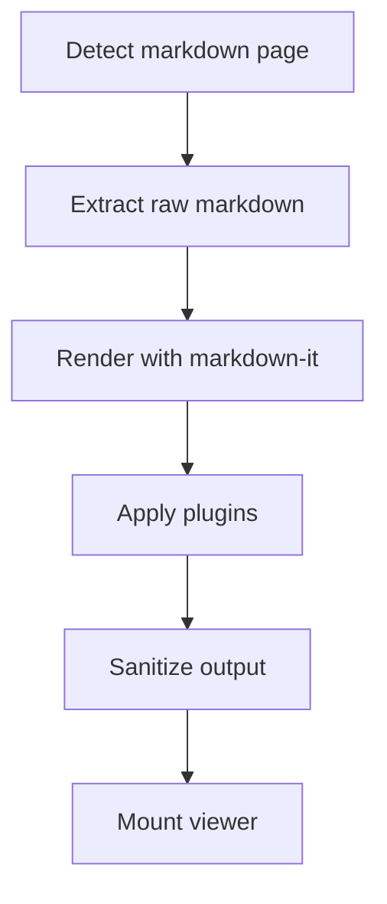
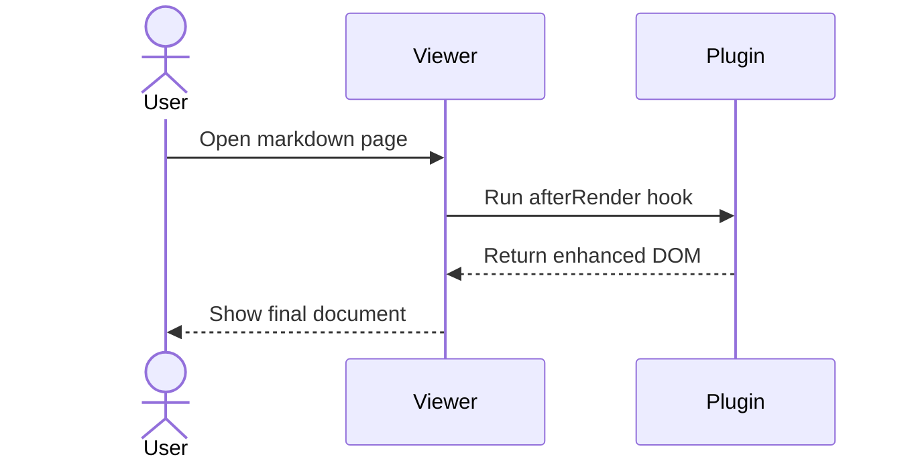

# Markdown Plus - Comprehensive Test Document

Muc tieu file:
1. Test day du cac chuc nang chinh cua extension tren 1 markdown file.
2. Cover ca case thanh cong va case loi/fallback.
3. Phan test performance duoc dat o cuoi file (uu tien sau).

---

## 1. Smoke Checklist (run first)

- Viewer mount dung, khong vo layout.
- TOC render du heading va click jump dung.
- Active TOC update dung khi scroll len/xuong.
- Settings toggle plugin lam noi dung thay doi dung.
- Code copy button va language label hoat dong.
- Optional plugins (emoji/footnote/math/mermaid) co ON/OFF behavior dung.
- Invalid syntax khong lam vo toan document.
- Sanitize xu ly dung HTML khong an toan.

---

## 2. TOC and Scroll Spy Core

### 2.1 Top heading target

Scroll qua section 2, 3, 4 de theo doi TOC active item.

### 2.2 Child heading target

Noi dung ngan de tao moc TOC.

#### 2.2.1 Nested child

Noi dung ngan.

##### 2.2.1.1 Deep nested child

Noi dung ngan.

### 2.3 Click-to-scroll target

Khi click TOC vao heading nay:
- Vi tri scroll phai dung duoi toolbar sticky
- URL hash phai doi theo heading id
- Link TOC active dung

---

## 3. Typography and Inline Elements

Doan text thuong de test font-size, line-height, font-family.
**Bold text** de test strong.
*Italic text* de test em.
***Bold italic*** de test ket hop.
`inline code` de test mau inline code.

[External link to example](https://example.com)
[MDN link](https://developer.mozilla.org)

### 3.1 Internal vs External Link Rendering (Phase 0)

Muc tieu:
- Internal links khong bi gan `target="_blank"`.
- External links van giu `target="_blank"` + `rel="noopener noreferrer"`.

Internal link samples (expected: no target):
- [Relative markdown sibling](./other.md)
- [Relative markdown parent](../README.md#install)
- [Hash-only same document](#71-anchor-one)
- [Absolute file markdown](file:///tmp/sample.md)
- [Relative non-markdown asset](./image.png)

External link samples (expected: target="_blank"):
- [External HTTPS](https://example.com/docs)
- [Mailto link](mailto:test@example.com)
- [Tel link](tel:+84901234567)

Manual verification checklist:
1. Inspect the rendered `<a>` tags in viewer.
2. Confirm internal links above do not include `target="_blank"`.
3. Confirm HTTPS/mailto/tel links include both `target="_blank"` and `rel="noopener noreferrer"`.

### 3.2 Phase 1 Internal Link Navigation Test Pack

Muc tieu:
- Test click interception cho internal markdown links.
- Xac nhan self-link khong re-fetch.
- Xac nhan markdown file co hash scroll dung sau khi render.
- Xac nhan external va asset link van giu hanh vi mac dinh cua browser.

Use this section as the main manual QA area for internal hyperlink navigation.

Same document:
- [Hash-only same document target](#phase-1-target-section)

Self links:
- [Self link no hash](./sample-test-markdown.md)
- [Self link with hash](./sample-test-markdown.md#phase-1-target-section)

Sibling and nested markdown files:
- [Sibling file](./other.md)
- [Sibling file with hash](./other.md#intro)
- [Nested file](./guides/install.md)
- [Nested file with hash](./guides/install.md#step-2)

Parent file:
- [Project README parent link](../README.md)

File names with spaces, Unicode, and encoded href:
- [File with space in name](./My Notes.md)
- [Encoded href to file with space](./My%20Notes.md#encoded-heading)
- [Unicode file name](./ghi%20chu.md#unicode-target)

Expected fallback cases:
- [Broken markdown link](./missing-file.md)
- [Non-markdown asset](./assets/diagram.svg)
- [External HTTPS link](https://example.com/internal-nav-test)
- [Mailto link](mailto:test@example.com)

Modifier-key checks:
- Cmd/Ctrl + click on any markdown link above should open in browser default behavior.
- Middle click should also keep browser default behavior.

Expected results:
1. Internal markdown links open inside the viewer without full-page reload.
2. Self-link no hash scrolls to top only.
3. Self-link with hash scrolls to the heading only.
4. Broken link keeps current document visible and shows an error toast.
5. Asset/external links are not intercepted.

## Phase 1 Target Section

This heading exists so hash-only and self-link-with-hash checks have a stable target.

> Blockquote line 1
> Blockquote line 2
> Blockquote line 3

Escaped syntax:
- \*not italic\*
- \[not a link]
- \`not code\`
- \# not a heading

---

## 4. Lists and Task List Plugin

### 4.1 Normal lists

- Item A
- Item B
  - Item B.1
  - Item B.2
- Item C

1. Step one
2. Step two
3. Step three

### 4.2 Task list plugin

- [ ] Task 01 unchecked
- [x] Task 02 checked
- [ ] Task 03 long text lorem ipsum dolor sit amet consectetur adipiscing elit sed do eiusmod tempor
- [x] Task 04 checked
- [ ] Task 05 parent
  - [ ] Task 05.1 nested
  - [x] Task 05.2 nested checked

Expected:
- Plugin ON -> render checkbox UI.
- Plugin OFF -> giu nguyen markdown text `- [ ]`.

---

## 5. Code Blocks and Copy UX

### 5.1 JavaScript

```js
function fibonacci(n) {
  if (n <= 1) return n;
  let a = 0;
  let b = 1;
  for (let i = 2; i <= n; i += 1) {
    const next = a + b;
    a = b;
    b = next;
  }
  return b;
}

for (let i = 0; i < 10; i += 1) {
  console.log(i, fibonacci(i));
}
```

### 5.2 JSON

```json
{
  "name": "markdown-plus",
  "version": "0.1.0",
  "plugins": {
    "codeHighlight": { "enabled": true },
    "taskList": { "enabled": true },
    "anchorHeading": { "enabled": true },
    "tableEnhance": { "enabled": true },
    "emoji": { "enabled": true },
    "footnote": { "enabled": true },
    "math": { "enabled": false },
    "mermaid": { "enabled": false }
  }
}
```

### 5.3 Bash

```bash
echo "Testing markdown viewer"
node -v
npm -v
```

### 5.4 HTML/CSS

```html
<article class="doc">
  <h1>Hello Markdown Plus</h1>
  <p>Render me safely.</p>
</article>
```

```css
.doc {
  max-width: 980px;
  margin: 0 auto;
  line-height: 1.7;
}
```

Expected:
- Plugin ON -> syntax highlight + copy button.
- Plugin OFF -> plain fenced code.

---

## 6. Tables and Table Enhance Plugin

| Name | Role | Status | Score |
| --- | --- | --- | ---: |
| Alpha | Reader | Active | 95 |
| Beta | Writer | Active | 87 |
| Gamma | Editor | Paused | 79 |
| Delta | Reviewer | Active | 91 |

### 6.1 Wide table stress

| Col-01 | Col-02 | Col-03 | Col-04 | Col-05 | Col-06 | Col-07 | Col-08 |
| --- | --- | --- | --- | --- | --- | --- | --- |
| `very_long_token_without_spaces_aaaaaaaaaaaaaaaaaaaaaaaaaaaa` | `very_long_token_without_spaces_bbbbbbbbbbbbbbbbbbbbbbbbbbbb` | `very_long_token_without_spaces_cccccccccccccccccccccccccccc` | `very_long_token_without_spaces_dddddddddddddddddddddddddddd` | `very_long_token_without_spaces_eeeeeeeeeeeeeeeeeeeeeeeeeeee` | `very_long_token_without_spaces_ffffffffffffffffffffffffffff` | `very_long_token_without_spaces_gggggggggggggggggggggggggggg` | `very_long_token_without_spaces_hhhhhhhhhhhhhhhhhhhhhhhhhhhh` |

Expected:
- Plugin ON -> table boc trong wrapper scroll ngang.
- Plugin OFF -> table plain, de tran ngang.

---

## 7. Anchor Heading Plugin

### 7.1 Anchor one

Neu plugin ON, heading hien icon/hash anchor de copy link.

### 7.2 Anchor two

Test click vao icon/hash de doi URL hash.

#### 7.2.1 Deep anchor

Test heading cap sau.

---

## 8. Emoji Plugin (optional)

Expected:
- ON -> shortcode render thanh emoji.
- OFF -> shortcode giu nguyen text.

Emoji samples:
- :smile: :rocket: :tada:
- :bug: :wrench: :white_check_mark:
- Deploy complete :rocket: and tests passed :white_check_mark:

---

## 9. Footnote Plugin (optional)

Doan nay co footnote thu nhat.[^fn-a]
Doan nay co footnote thu hai voi link.[^fn-b]
Doan nay co 2 footnotes lien tiep.[^fn-c][^fn-d]

[^fn-a]: Footnote 1 with **bold** and `inline code`.
[^fn-b]: Footnote 2 see [MDN](https://developer.mozilla.org).
[^fn-c]: Footnote 3 test multiple refs.
[^fn-d]: Footnote 4 test backref.

Expected:
- ON -> superscript refs + footnote list cuoi.
- OFF -> syntax giu nguyen text markdown.

---

## 10. Math Plugin (optional)

Expected:
- ON -> KaTeX render.
- OFF -> giu nguyen `$...$` va `$$...$$`.

Inline math:
- Pythagoras: $a^2 + b^2 = c^2$
- Euler identity: $e^{i\pi} + 1 = 0$
- Sigma: $\sum_{k=1}^{n} k = \frac{n(n+1)}{2}$

Display math:
$$
\int_{0}^{1} x^2 \, dx = \frac{1}{3}
$$

$$
\mathrm{softmax}(x_i) = \frac{e^{x_i}}{\sum_{j=1}^{n} e^{x_j}}
$$

Invalid math (fallback test):
- Inline invalid: $ \frac{1}{ $

$$
\frac{1}{\left(
$$

---

## 11. Mermaid Plugin (optional)

Expected:
- ON -> mermaid block render thanh SVG.
- OFF -> hien nhu code fence thuong.
- Invalid syntax -> fail gracefully, khong vo toan bo render.

Flowchart:


Sequence:


Invalid mermaid:
```mermaid
this is not a valid mermaid diagram
```

---

## 12. Sanitization and Raw HTML Cases

<details>
  <summary>Native details/summary block</summary>
  <p>Should still work and stay readable.</p>
</details>

Inline HTML mark: <mark>highlight me</mark> and <kbd>Ctrl</kbd> + <kbd>S</kbd>.

Potentially unsafe HTML snippets (khong duoc execute):

```html
<script>alert('xss')</script>
<iframe src="https://example.com"></iframe>

```

Expected:
- Renderer sanitize dung, khong execute script event handlers.
- Viewer van render on dinh.

---

## 13. Mixed Edge Cases Matrix

### 13.1 Mermaid inside non-mermaid code fence

````txt

````

### 13.2 Math inside code fence

```txt
Inline $a+b$ and display $$x^2$$ should stay plain in this fence.
```

### 13.3 Reference links

Reference style: [OpenAI Docs][openai-docs], [MDN][mdn], [BrokenRef][not-found].

[openai-docs]: https://platform.openai.com/docs
[mdn]: https://developer.mozilla.org

### 13.4 Nested blockquote + list + code

> Quote level 1
> > Quote level 2
> > - item A
> > - item B
> > ```js
> > const inQuote = true
> > ```
> Back to level 1

---

## 14. Final Functional Validation

Neu ban test het toi day:
- TOC
- Scroll spy
- code highlight + copy
- task list
- table enhance
- anchor heading
- emoji
- footnote
- math
- mermaid
- sanitize
- edge/fallback cases

thi co the danh gia extension cover feature chinh va case loi co ban.

---

# Performance Section (run after functional pass)

Muc tieu phan nay: tao tai lieu dai, nhieu headings, nhieu khoang scroll de benchmark.

## P1. Performance Check Instructions

1. Bat DevTools Performance, record 5-10s khi scroll lien tuc.
2. Theo doi fps, main thread, va behavior TOC active.
3. So sanh khi plugin nang (mermaid/math) ON va OFF.

---

## P2. Heading Density Stress

### P2.1 H3
#### P2.1.1 H4
##### P2.1.1.1 H5
###### P2.1.1.1.1 H6

### P2.2 H3
#### P2.2.1 H4
##### P2.2.1.1 H5
###### P2.2.1.1.1 H6

### P2.3 H3
#### P2.3.1 H4
##### P2.3.1.1 H5
###### P2.3.1.1.1 H6

### P2.4 H3
#### P2.4.1 H4
##### P2.4.1.1 H5
###### P2.4.1.1.1 H6

### P2.5 H3
#### P2.5.1 H4
##### P2.5.1.1 H5
###### P2.5.1.1.1 H6

---

## P3. Long Paragraph Dummy Blocks

Block 01: This line exists to increase document size and scroll distance.
Block 02: This line exists to increase document size and scroll distance.
Block 03: This line exists to increase document size and scroll distance.
Block 04: This line exists to increase document size and scroll distance.
Block 05: This line exists to increase document size and scroll distance.
Block 06: This line exists to increase document size and scroll distance.
Block 07: This line exists to increase document size and scroll distance.
Block 08: This line exists to increase document size and scroll distance.
Block 09: This line exists to increase document size and scroll distance.
Block 10: This line exists to increase document size and scroll distance.
Block 11: This line exists to increase document size and scroll distance.
Block 12: This line exists to increase document size and scroll distance.
Block 13: This line exists to increase document size and scroll distance.
Block 14: This line exists to increase document size and scroll distance.
Block 15: This line exists to increase document size and scroll distance.
Block 16: This line exists to increase document size and scroll distance.
Block 17: This line exists to increase document size and scroll distance.
Block 18: This line exists to increase document size and scroll distance.
Block 19: This line exists to increase document size and scroll distance.
Block 20: This line exists to increase document size and scroll distance.
Block 21: This line exists to increase document size and scroll distance.
Block 22: This line exists to increase document size and scroll distance.
Block 23: This line exists to increase document size and scroll distance.
Block 24: This line exists to increase document size and scroll distance.
Block 25: This line exists to increase document size and scroll distance.
Block 26: This line exists to increase document size and scroll distance.
Block 27: This line exists to increase document size and scroll distance.
Block 28: This line exists to increase document size and scroll distance.
Block 29: This line exists to increase document size and scroll distance.
Block 30: This line exists to increase document size and scroll distance.
Block 31: This line exists to increase document size and scroll distance.
Block 32: This line exists to increase document size and scroll distance.
Block 33: This line exists to increase document size and scroll distance.
Block 34: This line exists to increase document size and scroll distance.
Block 35: This line exists to increase document size and scroll distance.
Block 36: This line exists to increase document size and scroll distance.
Block 37: This line exists to increase document size and scroll distance.
Block 38: This line exists to increase document size and scroll distance.
Block 39: This line exists to increase document size and scroll distance.
Block 40: This line exists to increase document size and scroll distance.
Block 41: This line exists to increase document size and scroll distance.
Block 42: This line exists to increase document size and scroll distance.
Block 43: This line exists to increase document size and scroll distance.
Block 44: This line exists to increase document size and scroll distance.
Block 45: This line exists to increase document size and scroll distance.
Block 46: This line exists to increase document size and scroll distance.
Block 47: This line exists to increase document size and scroll distance.
Block 48: This line exists to increase document size and scroll distance.
Block 49: This line exists to increase document size and scroll distance.
Block 50: This line exists to increase document size and scroll distance.

---

## P4. Many Short Headings for TOC Stress

### P4.01
### P4.02
### P4.03
### P4.04
### P4.05
### P4.06
### P4.07
### P4.08
### P4.09
### P4.10
### P4.11
### P4.12
### P4.13
### P4.14
### P4.15
### P4.16
### P4.17
### P4.18
### P4.19
### P4.20
### P4.21
### P4.22
### P4.23
### P4.24
### P4.25
### P4.26
### P4.27
### P4.28
### P4.29
### P4.30

---

## P5. 500+ Heading Stress Pack

### P5.001
### P5.002
### P5.003
### P5.004
### P5.005
### P5.006
### P5.007
### P5.008
### P5.009
### P5.010
### P5.011
### P5.012
### P5.013
### P5.014
### P5.015
### P5.016
### P5.017
### P5.018
### P5.019
### P5.020
### P5.021
### P5.022
### P5.023
### P5.024
### P5.025
### P5.026
### P5.027
### P5.028
### P5.029
### P5.030
### P5.031
### P5.032
### P5.033
### P5.034
### P5.035
### P5.036
### P5.037
### P5.038
### P5.039
### P5.040
### P5.041
### P5.042
### P5.043
### P5.044
### P5.045
### P5.046
### P5.047
### P5.048
### P5.049
### P5.050
### P5.051
### P5.052
### P5.053
### P5.054
### P5.055
### P5.056
### P5.057
### P5.058
### P5.059
### P5.060
### P5.061
### P5.062
### P5.063
### P5.064
### P5.065
### P5.066
### P5.067
### P5.068
### P5.069
### P5.070
### P5.071
### P5.072
### P5.073
### P5.074
### P5.075
### P5.076
### P5.077
### P5.078
### P5.079
### P5.080
### P5.081
### P5.082
### P5.083
### P5.084
### P5.085
### P5.086
### P5.087
### P5.088
### P5.089
### P5.090
### P5.091
### P5.092
### P5.093
### P5.094
### P5.095
### P5.096
### P5.097
### P5.098
### P5.099
### P5.100
### P5.101
### P5.102
### P5.103
### P5.104
### P5.105
### P5.106
### P5.107
### P5.108
### P5.109
### P5.110
### P5.111
### P5.112
### P5.113
### P5.114
### P5.115
### P5.116
### P5.117
### P5.118
### P5.119
### P5.120
### P5.121
### P5.122
### P5.123
### P5.124
### P5.125
### P5.126
### P5.127
### P5.128
### P5.129
### P5.130
### P5.131
### P5.132
### P5.133
### P5.134
### P5.135
### P5.136
### P5.137
### P5.138
### P5.139
### P5.140
### P5.141
### P5.142
### P5.143
### P5.144
### P5.145
### P5.146
### P5.147
### P5.148
### P5.149
### P5.150
### P5.151
### P5.152
### P5.153
### P5.154
### P5.155
### P5.156
### P5.157
### P5.158
### P5.159
### P5.160
### P5.161
### P5.162
### P5.163
### P5.164
### P5.165
### P5.166
### P5.167
### P5.168
### P5.169
### P5.170
### P5.171
### P5.172
### P5.173
### P5.174
### P5.175
### P5.176
### P5.177
### P5.178
### P5.179
### P5.180
### P5.181
### P5.182
### P5.183
### P5.184
### P5.185
### P5.186
### P5.187
### P5.188
### P5.189
### P5.190
### P5.191
### P5.192
### P5.193
### P5.194
### P5.195
### P5.196
### P5.197
### P5.198
### P5.199
### P5.200
### P5.201
### P5.202
### P5.203
### P5.204
### P5.205
### P5.206
### P5.207
### P5.208
### P5.209
### P5.210
### P5.211
### P5.212
### P5.213
### P5.214
### P5.215
### P5.216
### P5.217
### P5.218
### P5.219
### P5.220
### P5.221
### P5.222
### P5.223
### P5.224
### P5.225
### P5.226
### P5.227
### P5.228
### P5.229
### P5.230
### P5.231
### P5.232
### P5.233
### P5.234
### P5.235
### P5.236
### P5.237
### P5.238
### P5.239
### P5.240
### P5.241
### P5.242
### P5.243
### P5.244
### P5.245
### P5.246
### P5.247
### P5.248
### P5.249
### P5.250
### P5.251
### P5.252
### P5.253
### P5.254
### P5.255
### P5.256
### P5.257
### P5.258
### P5.259
### P5.260
### P5.261
### P5.262
### P5.263
### P5.264
### P5.265
### P5.266
### P5.267
### P5.268
### P5.269
### P5.270
### P5.271
### P5.272
### P5.273
### P5.274
### P5.275
### P5.276
### P5.277
### P5.278
### P5.279
### P5.280
### P5.281
### P5.282
### P5.283
### P5.284
### P5.285
### P5.286
### P5.287
### P5.288
### P5.289
### P5.290
### P5.291
### P5.292
### P5.293
### P5.294
### P5.295
### P5.296
### P5.297
### P5.298
### P5.299
### P5.300
### P5.301
### P5.302
### P5.303
### P5.304
### P5.305
### P5.306
### P5.307
### P5.308
### P5.309
### P5.310
### P5.311
### P5.312
### P5.313
### P5.314
### P5.315
### P5.316
### P5.317
### P5.318
### P5.319
### P5.320
### P5.321
### P5.322
### P5.323
### P5.324
### P5.325
### P5.326
### P5.327
### P5.328
### P5.329
### P5.330
### P5.331
### P5.332
### P5.333
### P5.334
### P5.335
### P5.336
### P5.337
### P5.338
### P5.339
### P5.340
### P5.341
### P5.342
### P5.343
### P5.344
### P5.345
### P5.346
### P5.347
### P5.348
### P5.349
### P5.350
### P5.351
### P5.352
### P5.353
### P5.354
### P5.355
### P5.356
### P5.357
### P5.358
### P5.359
### P5.360
### P5.361
### P5.362
### P5.363
### P5.364
### P5.365
### P5.366
### P5.367
### P5.368
### P5.369
### P5.370
### P5.371
### P5.372
### P5.373
### P5.374
### P5.375
### P5.376
### P5.377
### P5.378
### P5.379
### P5.380
### P5.381
### P5.382
### P5.383
### P5.384
### P5.385
### P5.386
### P5.387
### P5.388
### P5.389
### P5.390
### P5.391
### P5.392
### P5.393
### P5.394
### P5.395
### P5.396
### P5.397
### P5.398
### P5.399
### P5.400
### P5.401
### P5.402
### P5.403
### P5.404
### P5.405
### P5.406
### P5.407
### P5.408
### P5.409
### P5.410
### P5.411

---

Ket thuc file comprehensive test.
